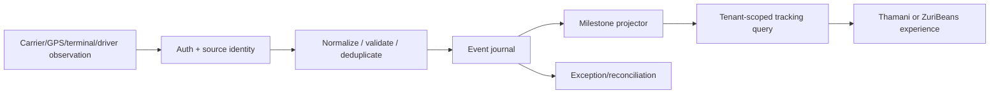

# ADR-TMS-0007 — Tracking, Milestones, Events, Telemetry and Visibility Architecture

**Status:** Proposed — architectural review; not yet accepted or implemented  
**Date:** 2026-10-08  
**Repository:** baobab-platform/baobab-tms  
**Depends on:** Accepted ADR-TMS-0001 and ADR-TMS-0002; TMS-TECH-01 technology constraints; applicable Shared contracts  
**Authority:** Shared owns canonical contracts/events, CP owns context/provider/activation, IAM authenticates; TMS owns transport execution  

> This decision describes required future behaviour and testing, not deployed software, provider certification, live tracking coverage, qualified carrier relationships or market permission.

## 1. Decision
TMS owns **transport-domain operational observations and their verified projections**, not absolute truth about all externally performed activities. Model each TransportEvent as an immutable sourced fact/observation with independently recorded **occurred_at**, **recorded_at**, source, subject, tenant, source-event identifier, location (when permissible), confidence/verification, provider signature context, correlation/causation and payload/reference. An event is not the mutable current state. Telemetry samples are not automatically authorised milestones.

## 2. Types of observations
| Class | Examples | Decision rule |
|---|---|---|
| Planned | expected pickup/call/delivery window | plan version and scheduling authority; not actual |
| Estimated | carrier ETA, predictive ETA, delay estimate | source/model/version/confidence and recalculation time required |
| Reported actual | driver claims picked up; carrier says vessel departed | retain original attribution and confidence; may require corroboration |
| Authoritatively confirmed | signed carrier gate event; authorised recipient delivery acknowledgement | source/authority verification and policy-based trust |
| Derived milestone | in-transit, late, delivered operational projection | reconstructable from accepted events and policy version |
| Raw telemetry | GPS position, temperature/sensor observations | high volume, differential retention; do not make all samples canonical business events |

Milestones have stable semantic codes or governed mapping with provenance. "Arrived at port" != customs entry/release, "at recipient site" != delivered/accepted, "carrier says delivered" != signed POD verified.

## 3. Event ordering and state
- Accept late, duplicate and out-of-order observations through a trusted inbox with per-provider event ID/subject and digest. An identical retry is no-op; same ID with conflicting digest creates reconciliation exception.
- Separate occurred time, provider creation time, Baobab receipt time and recorded time; clock-skew or absent timezone requires explicit uncertainty, not inferred chronology.
- Operational projection uses a documented deterministic reducer and versioned semantics. A late trusted pickup event can refine history without destroying a previously recorded dispatch fact.
- No client/provider can freely move another tenant's transport shipment state by submitting a status string.
- Source-priority/trust is configured by observation type and carrier relationship; contradictory events open an exception rather than silently selecting "last writer wins".
- External corrections are **new** retraction/correction observations linked to earlier event, not destructive UPDATE of immutable fact history.
- High-frequency positions can live in bounded telemetry storage with retention/aggregation distinct from durable canonical milestones; reject duplicate/invalid/bogus coordinates.

## 4. Visibility and data protection
Define explicit projections: dispatcher/internal, contracted carrier, buyer/supplier, customer public tracking token (limited rights and lifetime), regulator/auditor and partner. Carriers never see competing carrier cost, unrelated movements, driver PII or Nabhold sibling tenants.

GPS must be purpose-limited with data classification, consent/legal basis where required, retention and residency review, field redaction, endpoint scopes and revocable share links. Share public links only with cryptographically strong unguessable tokens, short lifetime and revocation; links should not expose direct private evidence artifacts.

## 5. Standards and interoperability
DCSA maritime event types, GS1 EPCIS visibility and IATA ONE Record air cargo may inform **mode adapters**. No standard replaces the canonical domain or authorises itself to produce Shared logistics events. Keep native code/reason, translation version and mapping confidence alongside normalized events. No promise of ocean/vessel/air real-time coverage without live source proof.

## 6. Interfaces
Candidate local surfaces: ingest-tracking-observation, resolve-shipment-timeline, query-milestone, get-ETA and subscribe-to-visibility-projection. Canonical external events require Shared accepted logistics contracts/producer rules; anonymous GPS ingestion is prohibited. Use transactional outbox for material milestone publication and a DLQ/reconciliation queue for unmappable carrier observations.

## 7. Implementation gates
| Gate | Acceptance evidence |
|---|---|
| TMS-TRK-01 | Immutable event schema/provenance, time-zone/source semantics, consent and scope matrix |
| TMS-TRK-02 | Provider webhook authentication, duplicate/out-of-order/conflicting payload fixtures |
| TMS-TRK-03 | Deterministic milestone projection and historical replay on seeded events |
| TMS-TRK-04 | Customer/carrier/internal projection access-denial and GPS redaction/retention tests |
| TMS-TRK-05 | One self-hosted road dispatch source + simulated maritime events with explicit simulation labels |
| TMS-TRK-06 | Shared event conformance and CP-backed provider activation review, without premature production claim |

The first release may provide operational milestones **without** fleet GPS, ETA prediction or continuous global vessel tracking.

## 8. Alternatives and governance

Rejected: monolithic TMS-vendor domain authority, unaudited vendor callbacks, third-party IDs as canonical identity, copying document/ERP/Regulations decisions, tenant-specific engine forks, declaring candidate capabilities canonical or treating a successful sandbox test as CP certification. Accepted Shared contracts and previous Accepted TMS decisions take precedence. Any cross-owner wire semantic change must go through Shared as a separate PR.

## 9. Decision follow-up

Each gate is an independent implementation checkpoint with a PR, source paths, contract fixtures, negative tests, runtime metrics and explicitly documented unimplemented cases. The decision remains **Proposed** until formally accepted; no event/capability activation, staging approval or production acceptance is granted here.
