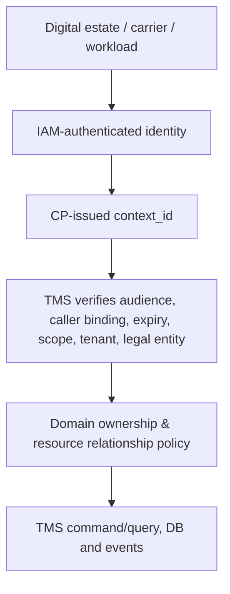

# ADR-TMS-0010 — Tenant, Isolation, Context and Canonical Reference Architecture

**Status:** Proposed — architectural review; not yet accepted or implemented  
**Date:** 2026-10-08  
**Repository:** baobab-platform/baobab-tms  
**Depends on:** Accepted ADR-TMS-0001 and ADR-TMS-0002; TMS-TECH-01 technology constraints; applicable Shared contracts  
**Authority:** Shared owns canonical contracts/events, CP owns context/provider/activation, IAM authenticates; TMS owns transport execution  

> This decision describes required future behaviour and testing, not deployed software, provider certification, live tracking coverage, qualified carrier relationships or market permission.

## 1. Decision
TMS is a multi-tenant, independently deployable engine. **Control Plane** is authoritative for tenant, legal entity, approved market participation, canonical organisation, capability provider/binding and context. **IAM** authenticates principals. TMS enforces domain-specific access and foreign-object relationship checks; it never mints global tenants, substitutes deployment IDs for business identities or gives Nabhold subsidiaries inherited access by common parentage.

## 2. Context trust chain

The caller may request a context, but user-supplied `tenant_id`, `legal_entity_id`, marketplace slug, X-Tenant header or query parameter alone **never** establish trusted operating scope. Context redemption must be bound to authenticated actor/workload/audience and the operation. Maintain a strategy for short-lived verification/caching that fails closed on revocation or unknown context; do not require a synchronous CP call for each internal TMS domain object creation if an already-verified context can be trusted.

## 3. Canonical identity and reference table
| Reference | Owner / allowed use | Constraint |
|---|---|---|
| `tenant_id / legal_entity_id / context_id` | CP | Scope and authority, not a shipment UUID |
| `LogisticsShipment / Consignment / TransportMovement IDs` | TMS | Stable TMS domain identity, unaffected by deployment or provider swap |
| `CanonicalEntity` | CP registry identity | Not automatically equal to TMS domain row |
| `CrossEngineObjectReference` | Shared schema; referenced object owned by respective engine | Explicit owner_engine_id, object_type, ID, scope, reference_mode, pinning |
| `ExternalReference` | External provider native object mapping | Never canonical business identity; retain provider/market scope |
| `engine_instance_id` | CP engine topology | Routing/deployment only, not portable shipment identity |
| `TradeShipment` | baobab-trade | Correlate to TMS LogisticsShipment, do not reassign producer authority |
| `DocumentVersion` | Trade Docs | Pin immutable version; possession does not grant access |

## 4. Isolation enforcement
Enforce tenant+legal-entity+relationship scope at **API**, domain service, SQL query/transaction, inbox, outbox, telemetry, caches, async workers and adapter credentials. If shared DB tables are used, tenant is mandatory and indexes/uniqueness are tenant-scoped; use PostgreSQL row-level security as defence-in-depth only if tests validate both session setup and fail-closed defaults. Background workers may only act under an explicitly resolved verified service context/authorisation snapshot with refresh/revocation handling.

Ownership and access are not the same: carrier staff access only their assigned bookings/movements; buyer sees only entitled shipment projection; parent Nabhold cannot read subsidiary shipment data absent an explicit permitted relationship. Shared IDs may appear across contexts only via separately governed cross-entity access.

## 5. Cross-market and privacy
Uganda and South Africa are initial markets, not code branches. Market relationship, operational corridor and regulatory jurisdiction are distinct. Cross-border shipments may span jurisdictions while preserving the original legal entity/tenant operating scope and relevant partner access. GPS, driver/receiver details, cargo risk and route/tracking metadata are classified; projections minimise exposure and follow POPIA/market-specific retention policies.

## 6. Security failure cases
Reject wrong audience, expired context, mismatched actor, invalid legal entity, nested foreign reference tenant mismatch, ambiguous market, cross-tenant assignment, stale entitlement and forged actor-role headers. Do not allow a service credential scoped to a carrier adapter to become an all-tenant admin token.

## 7. Implementation gates
| Gate | Objective evidence |
|---|---|
| TMS-TEN-01 | Context schema and model mapped to CP contract; canonical reference and ExternalReference test fixtures |
| TMS-TEN-02 | IAM/CP context redemption with wrong-audience, caller, expiry and revoked-grant tests |
| TMS-TEN-03 | Tenant/legal-entity SQL, cache, telemetry and async worker negative integration tests |
| TMS-TEN-04 | Carrier/customer/parent-company access matrix tested end to end |
| TMS-TEN-05 | Cross-market UG/ZA cases with legal-entity autonomy, corridor vs market separation and provenance |
| TMS-TEN-06 | Continuous conformance evidence for any CP/IAM contract upgrade before provider registration |

No production entitlement, subsidiary sharing agreement or CP CapabilityBinding is established by this document.

## 8. Alternatives and governance

Rejected: monolithic TMS-vendor domain authority, unaudited vendor callbacks, third-party IDs as canonical identity, copying document/ERP/Regulations decisions, tenant-specific engine forks, declaring candidate capabilities canonical or treating a successful sandbox test as CP certification. Accepted Shared contracts and previous Accepted TMS decisions take precedence. Any cross-owner wire semantic change must go through Shared as a separate PR.

## 9. Decision follow-up

Each gate is an independent implementation checkpoint with a PR, source paths, contract fixtures, negative tests, runtime metrics and explicitly documented unimplemented cases. The decision remains **Proposed** until formally accepted; no event/capability activation, staging approval or production acceptance is granted here.
