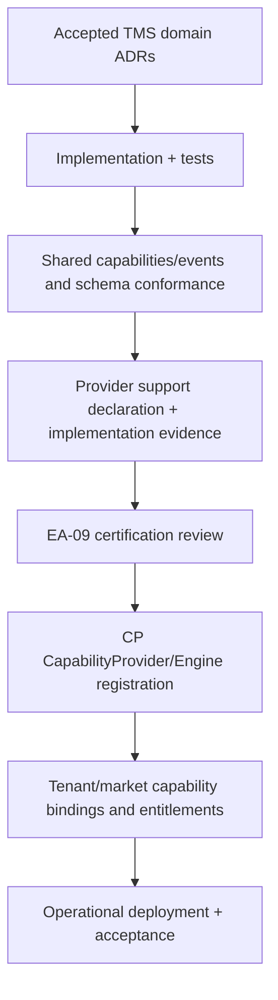

# ADR-TMS-0015 — Production Readiness, Capability Certification and Migration

**Status:** Proposed — pending architectural acceptance; not implementation or production certification  
**Date:** 2026-10-08  
**Repository:** baobab-platform/baobab-tms  
**Depends on:** Accepted ADR-TMS-0001 and ADR-TMS-0002; merged TMS-TECH-01 documentation; Shared and CP/IAM governance  
**Scope:** headless, self-hosted, provider-neutral transport execution for independently entitled Baobab tenants  

> This ADR is a design proposal. Names of illustrative operations, capabilities and events are **not** automatically registered Shared contracts, certified provider support, legal authorisations or deployed runtime claims.

## 1. Decision
TMS production support requires **independently evidenced capability implementation, Shared semantic contracts, Control Plane provider certification/activation, release controls, actual operational and external carrier proof**. Being headless or self-hosted, having Accepted ADRs, or passing PR CI is not sufficient. Release eligibility must be granted **per canonical capability, operation, provider version, environment, market and transport mode**, not as a blanket "TMS ready" flag.

## 2. Certification and authority chain

Governance detail: Shared **catalogue** describes canonical capability semantics, not executable provider availability; `.baobab/capability-provider.yaml` expresses implementation claims/plans, **not** certification, active support, endpoint hosts, tenant grants or runtime health. CP retains all provider bindings, activation, topology and legal-entity context. A simulated provider cannot be production permitted.

## 3. Legacy shipment/event migration
Accepted ADR-TMS-0001/0002 identify `contracts/shipment/v1` and `com.baobab-platform.trade.shipment.*` as **Trade-owned legacy semantics**. These must remain unchanged until a separate Shared reconciliation and approved consumer migration.

| Migration stage | Action | Evidence required |
|---|---|---|
| Inventory | enumerate Trade shipment v1 producers/consumers, customer journeys and external references | versioned source/consumer matrix |
| Semantic mapping | classify legacy fields/events as TradeShipment, LogisticsShipment, Consignment, Movement or independent cargo fact | accepted owner decisions, no silent event rename |
| New Shared contract | introduce versioned provider-neutral logistics domain reference and event/capability package | Shared approved PR, compatibility tests |
| Dual-flow | create correlated TMS LogisticsShipment without deleting TradeShipment; preserve both IDs | idempotent association, source and tenant trace |
| Projection comparison | reconcile plan, transport status and delivery against actual carrier facts | differences and exception ownership recorded |
| Cutover | enable entitled consumers through CP feature/routing gates; explicit rollback plan | measured acceptance and no orphaned live bookings |
| Retirement | deprecate old semantics only when all consumers validated and contractual window elapsed | consumer sign-off, preserved event history |

No event history reclassification, producer transfer or direct data migration from Trade into TMS occurs simply because this ADR is merged.

## 4. Evidence matrix
| Evidence category | Required before release |
|---|---|
| Semantic | accepted Shared capability keys, OpenAPI/AsyncAPI schemas, event producers and interoperability |
| Runtime | audited source paths, dependency pinning, SBOM, licences and repeatable builds |
| Data | migrations, transaction/replay, tenant isolation, backup+PITR restore, retention |
| Security | IAM/CP auth-context proofs, least privilege, signed callbacks, independent pentest findings disposition |
| Operational | measured latency/throughput, monitoring/alerting, DLQ, reconciliation runbooks, SLO/RPO/RTO drills |
| Business | one live-authorised carrier mode/market workflow, capacity/booking reconciliation, validated delivery evidence |
| Regulatory/customs | documented covered corridors and integration decision checks, no implied legal permission |
| Governance | provider-support declaration, EA-09 assessment, CP activation/binding, consent, market/legal owner approval |
| Customer | Thamani and ZuriBeans negative and positive end-to-end tests in segregated tenant contexts |

## 5. Progressive release
Start simulated, then integration-sandbox, staging with test partner, limited entitled pilot, gated controlled production. Observability, canary rollback, data migration and reconciliation are mandatory. Initial support might be road shipment tracking only; do **not** publish sea/air booking support without separate live proof.

Release manifests must preserve versioned Shared contract SHA, TMS app/artifact digest, database migration, configured adapters and feature gates. A pinned instance/branch tag is not proof of the correct tenant provider binding.

## 6. Implementation gates
| Gate | Acceptance |
|---|---|
| TMS-REL-01 | Document exact scope/market/mode/provider matrix and accepted Shared contract versions |
| TMS-REL-02 | Contract tests, implementation evidence and provider declaration consistency |
| TMS-REL-03 | End-to-end adverse case and security tests with at least two isolated tenants |
| TMS-REL-04 | Staging carrier integration, safe side-effect recovery and operator reconciliation drill |
| TMS-REL-05 | Backup/restore, telemetry SLO and incident runbooks review |
| TMS-REL-06 | EA-09 certification, CP registration/bindings/grants and approved controlled promotion |
| TMS-REL-07 | Post-cutover reconciliation and documented rollback/deprecation sign-offs |

This is an **acceptance protocol proposal**, not acceptance evidence. No capability is certified, activated or production-ready by this file.

## 7. Alternatives rejected and ownership consistency

Reject implicit ownership transfer from Trade, ERP, Trade Docs, Regulations, CP or IAM; vendor-native IDs as canonical IDs; shared cross-engine databases; market- or tenant-specific forks; untrusted callback acceptance; and any optimistic success caused by absent authoritative evidence. Contract changes require Shared acceptance; provider activation and certification require independent CP/EA-09 evidence.

## 8. Traceability and implementation status

Design intent inherits [ADR-TMS-0001](https://github.com/baobab-platform/baobab-tms/tree/main/docs/adr), [ADR-TMS-0002](https://github.com/baobab-platform/baobab-tms/tree/main/docs/adr) and [TMS-TECH-01](https://github.com/baobab-platform/baobab-tms/tree/main/docs/architecture); cross-engine relationships follow [Shared](https://github.com/baobab-platform/shared). Implement each listed gate in a bounded PR and add source, tests, conformance fixtures, operational evidence and documented deferrals. The repository does not gain a working engine simply by merging this ADR.
