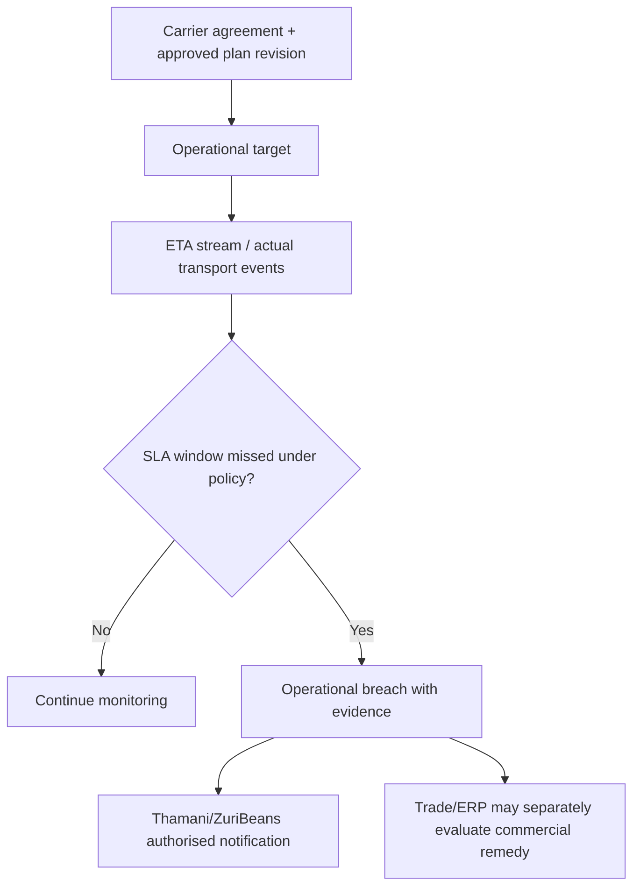

# ADR-TMS-0016 — Transport Service Levels, ETA and Operational Commitment Architecture

**Status:** Proposed — extension to charter programme; awaiting architecture acceptance  
**Date:** 2026-10-08  
**Repository:** baobab-platform/baobab-tms  
**Authority:** Accepted ADR-TMS-0001/0002, current Shared and CP/IAM governance; approved TMS implementation contracts only when separately registered  
**Programme note:** ADR-TMS-0016 through ADR-TMS-0019 extend the initial ADR-0001 programme (which originally ended at 0015); numbering and scope are proposals, not retroactively accepted charter decisions.  

> This document does not activate runtime, canonical capabilities, provider support, legal authority, production deployment or certified transport outcomes.

## 1. Why the decision is needed
Thamani and ZuriBeans need accurate pickup and delivery promises, exception alerts and ETA without confusing a carrier's forecast with a binding customer commercial commitment. Tracking ADR-TMS-0007 records observed/estimated milestones; ADR-TMS-0003 models schedules; this ADR distinguishes **contractual, operational and predictive** timelines and their ownership.

## 2. Decision
TMS SHALL own scoped **TransportServiceLevel**, **OperationalTarget**, **ETAObservation**, **SLAMeasurement** and **OperationalBreach** projections. A service level references a carrier or operational service agreement, a shipment/consignment allocation, a plan revision, leg(s), time windows, conditions and eligibility. The commercial customer delivery promise and financial remedies belong Trade/contract owner, not TMS.

| Term | Meaning | Authoritative source |
|---|---|---|
| CustomerPromise | Seller commitment to buyer, including fulfilment terms | Trade/Thamani selling business |
| CarrierServiceCommitment | Carrier contracted service window and exceptions | Signed carrier agreement/offer, referenced by TMS |
| PlannedArrival | Transport plan's expected scheduled arrival | TMS plan version |
| ETA | Source/prediction estimate; non-binding unless separately contracted | carrier/provider/model observation |
| ActualArrival | Provenance-bearing event observation | carrier/terminal/TMS validated event |
| OperationalBreach | TMS interpretation of missed service threshold, with policy version | TMS measurement |
| CommercialPenaltyOrRemedy | Contract liability, rebate, refund or damage claim | contracting/financial/legal authority |

## 3. ETA model
Each ETA snapshot requires: shipment/consignment/movement/call reference, source, generated_at, valid_as_of, expected UTC instant or interval, source timezone, plan revision, algorithm/forecast version, confidence range if available, and "based on" evidence identifiers. A forecast without verifiable input may be displayed only as low-confidence or unavailable. Do not invent a precise delivery time when a carrier or routing source is absent.

ETA updates **must not** rewrite planned windows or actual events. Replanning creates a new transport plan revision under ADR-0003, and may trigger a fresh estimate. A stale ETA and a late actual event must coexist in history; downstream display chooses an honest, freshness-marked projection.

## 4. SLA evaluation and escalation
Specify threshold basis (pickup at gate, handover complete, delivered, signed acceptance), customer/carrier holidays and time zones, excluded durations, exception causes, evidence source, and clock policy. A service commitment must be linked to contract reference and effective date before a breach is treated as contractual. Use configurable severity and notices to operational actors without automatic invoice adjustment or acceptance of carrier liability.

## 5. Tenant and experience controls
Tenant-independent canonical TMS domain; per-contract/market policy determines windows and actors. Track external partner response times separately from transport SLA. Customer views must reveal forecast confidence and last update, not expose driver route/PII or confidential carrier buy rate. A subscription to tracking updates requires entitlements and revocable access.

## 6. Failure cases
Absent traffic/road data, multi-border delays, late vessel schedule, clock skew, retroactive carrier correction, time-zone DST transitions, route revision, conflicting ETA sources and partial delivery must generate explicit assessment outcomes. A missing event does not prove a shipment was late; unknown is a valid state.

## 7. Implementation gates
| Gate | Objective evidence |
|---|---|
| TMS-SLA-01 | Separate contractual vs operational vs forecast schemas and authority matrix |
| TMS-SLA-02 | Window/calendar/timezone/holiday fixtures and deterministic SLA evaluator |
| TMS-SLA-03 | ETA source/freshness/confidence propagation, no fabricated ETA tests |
| TMS-SLA-04 | Breach acknowledgement/escalation with duplicate/late events and plan revision |
| TMS-SLA-05 | Tenant/consumer projection controls; no automated customer remedy |
| TMS-SLA-06 | Field trial versus reliable partner events before any ETA accuracy/support claim |

No specific ETA provider, modelling service or real-time guarantee is selected by this ADR.

## 8. Rejected shortcuts, dependencies and non-claims

Do not create tenant-specific TMS engines, assume external provider assertions are verified facts, collapse legal/commercial/document/financial authority into TMS, write another engine's operational database, or equate model/solver/API availability with production service acceptance. Any Shared schema/event/capability change requires an accepted Shared PR, and provider activation requires Control Plane/EA-09 evidence. Follow up with bounded implementation PRs, tests and explicit unsupported-case reporting.

## 9. Traceability

This proposal extends [the accepted TMS charter and canonical domain ADRs](https://github.com/baobab-platform/baobab-tms/tree/main/docs/adr), complements [TMS-TECH-01](https://github.com/baobab-platform/baobab-tms/tree/main/docs/architecture) and follows [Shared cross-engine reference/contract governance](https://github.com/baobab-platform/shared). The TMS headless/self-hosted requirement and Thamani/ZuriBeans tenant independence remain unchanged.
