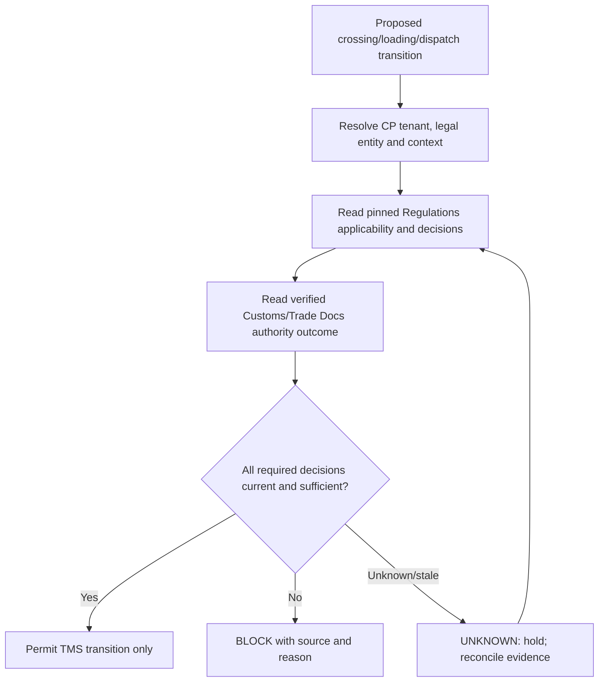

# ADR-TMS-0018 — Regulatory and Customs Execution Gates

**Status:** Proposed — extension to charter programme; awaiting architecture acceptance  
**Date:** 2026-10-08  
**Repository:** baobab-platform/baobab-tms  
**Authority:** Accepted ADR-TMS-0001/0002, current Shared and CP/IAM governance; approved TMS implementation contracts only when separately registered  
**Programme note:** ADR-TMS-0016 through ADR-TMS-0019 extend the initial ADR-0001 programme (which originally ended at 0015); numbering and scope are proposals, not retroactively accepted charter decisions.  

> This document does not activate runtime, canonical capabilities, provider support, legal authority, production deployment or certified transport outcomes.

## 1. Why the decision is needed
TMS executes physical movement across borders and markets, but is not competent to decide legal importability, Customs clearance, SPS compliance, permits or sanctions on its own. Accepted ADR-TMS-0001 establishes Regulations as policy-decision authority and Trade Docs as documentary/Customs-workflow authority. This ADR defines how TMS **enforces** verified external decisions at sensitive transport transitions.

## 2. Decision
Implement a **TransportExecutionGate** per guarded operation and scope. The gate evaluates required, current **Regulations RegulatoryDecision** and **Trade Docs CustomsCase/authority-response evidence** using authorised, pinned references. A gate result is **ALLOW / BLOCK / UNKNOWN / NOT_APPLICABLE** with decision source, version, temporal validity, applicable subject/cargo/leg, evidence references, actor/policy version and audit. TMS only applies the result to its operational transition.

An **ALLOW** means only this TMS transport-domain action is eligible; it is **not** a general trading permit, Customs release, title transfer, insurance coverage, national regulatory certification or customer promise.

## 3. Scope and gate matrix
| Guarded transition example | Typical external fact/decision | Default if mandatory fact missing |
|---|---|---|
| Hazardous/refrigerated carrier assignment | Regulations applicable carrier/cargo obligations + resource safety evidence | block relevant assignment |
| Export-origin movement dispatch | export restrictions/permits applicable to goods, parties and market | hold if mandated coverage missing |
| Arrival at border | no automatic release is needed to observe arrival | record arrival; hold onward gated action |
| Cross-border departure from controlled terminal | Customs/terminal release or bond/transit authority where legally required | block departure from controlled context |
| Inland transit under customs bond | Trade Docs transit case/permit/guarantee status | block restricted next leg |
| Final release/recipient delivery | authoritative Customs status where delivery is legally conditioned | block relevant handover |
| Historical query/tracking | original facts and contemporaneous decision reference | do not erase observations because policy later changes |

Policies must be product, route, market, mode and effective-time scoped. No single global `customs_released` flag for an entire multimodal shipment when some consignments/legs are held and others are released.

## 4. Historical pinning and staleness
Use Shared CrossEngineObjectReference with correct pinning to source-owned RegulatoryDecision, DocumentVersion and CustomsCase/authority outcome. Preserve decision-retrieved-at, effective period and subject match. If a decision is revoked, superseded, stale or no longer covers the revised route/cargo/parties, a pending or future guarded transition must be re-evaluated. Do not rewrite historical proof that an earlier operation was authorised under an earlier decision.

Regulations requirement resolution and assessment endpoints belong Regulations; document evidence/Customs workflow belongs Trade Docs. TMS may call contract-approved APIs but must **not** independently execute tariff classification or determine document adequacy.

## 5. Event and command directions
External documents/regulatory events are **facts about a changed decision or evidence**. Their arrival causes a TMS reassessment process, not implicit issuance of a transport command. A transport dispatch command is explicitly authorised after gate evaluation. Operational departure is a separately observed fact. Events and cross-engine transport references require Shared registration and producer stewardship.

## 6. Fail-closed and override
Fail-closed on mandatory unknown decision, mismatched tenant, altered pinned version, scope mismatch, untrusted Customs callback, unsupported jurisdiction or unsafe resource. A human dispatcher cannot override a sovereign/Regulations prohibition with an admin click. Operator review can correct source mappings or resubmit for authoritative determination; any legal exception must originate from the competent source and be pinned as evidence.

## 7. Implementation gates
| Gate | Evidence |
|---|---|
| TMS-GATE-01 | Guarded-transition matrix and owning-engine source/authority map per lane/mode |
| TMS-GATE-02 | RTD-05 pinned cross-engine references and Regulations decision contract conformance |
| TMS-GATE-03 | Trade Docs customs response authenticity/version and source temporal policy checks |
| TMS-GATE-04 | Negative tests for expired, revoked, ambiguous, wrong-tenant, unavailable and conflicting decisions |
| TMS-GATE-05 | Ugandan export -> South African import synthetic corridor with customs holds and later authorised release |
| TMS-GATE-06 | Live corridor authority integration only after external agency/partner sandbox and legal review |

This ADR defines an enforcement point, NOT national customs connectivity, legal coverage certification, a regulatory decision producer or automatic gate activation.

## 8. Rejected shortcuts, dependencies and non-claims

Do not create tenant-specific TMS engines, assume external provider assertions are verified facts, collapse legal/commercial/document/financial authority into TMS, write another engine's operational database, or equate model/solver/API availability with production service acceptance. Any Shared schema/event/capability change requires an accepted Shared PR, and provider activation requires Control Plane/EA-09 evidence. Follow up with bounded implementation PRs, tests and explicit unsupported-case reporting.

## 9. Traceability

This proposal extends [the accepted TMS charter and canonical domain ADRs](https://github.com/baobab-platform/baobab-tms/tree/main/docs/adr), complements [TMS-TECH-01](https://github.com/baobab-platform/baobab-tms/tree/main/docs/architecture) and follows [Shared cross-engine reference/contract governance](https://github.com/baobab-platform/shared). The TMS headless/self-hosted requirement and Thamani/ZuriBeans tenant independence remain unchanged.
