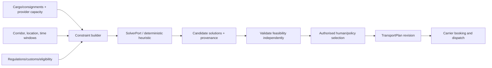

# ADR-TMS-0019 — Transport Optimisation, Simulation and Decision Support Architecture

**Status:** Proposed — extension to charter programme; awaiting architecture acceptance  
**Date:** 2026-10-08  
**Repository:** baobab-platform/baobab-tms  
**Authority:** Accepted ADR-TMS-0001/0002, current Shared and CP/IAM governance; approved TMS implementation contracts only when separately registered  
**Programme note:** ADR-TMS-0016 through ADR-TMS-0019 extend the initial ADR-0001 programme (which originally ended at 0015); numbering and scope are proposals, not retroactively accepted charter decisions.  

> This document does not activate runtime, canonical capabilities, provider support, legal authority, production deployment or certified transport outcomes.

## 1. Why the decision is needed
Baobab must optimise routes, consolidate consignments and evaluate carrier/operational plans without adopting a mandatory external TMS suite or assuming a solver can decide legal/safety feasibility. ADR-TMS-0003 governs executable plan identity, ADR-TMS-0004 booking and ADR-TMS-0006 operational buy-cost estimates; this ADR owns **decision-support evaluation and reproducibility**, not transport facts or authorised commitments.

## 2. Decision
Define a **TransportOptimisationProblem**, **ConstraintSet**, **Scenario**, **CandidateSolution**, **FeasibilityAssessment**, **ObjectiveVector**, **SolverExecution** and **Decision/ApprovalReference**. These are transport planning aids whose solutions become a transport plan **only after explicit approval** under ADR-TMS-0003. TMS remains headless and self-hosted; no routing vendor or optimisation runtime is mandatory at Foundation-1.

## 3. Constraint and objective types
| Type | Examples | Hard/soft handling |
|---|---|---|
| Cargo | mass/volume/dimensions/handling units, dangerous goods, temperature and security | hard unless explicitly waivable by authorised party |
| Capacity | vehicle/pallet/weight/space, carrier eligibility, equipment compatibility | hard |
| Geography/corridor | admissible border route, closed road, port/terminal constraints, transit requirements | authoritative legal restrictions hard; uncertain source flagged |
| Temporal | pickup/dropoff windows, driving rules, port calls, flight/vessel schedules, promised time | some soft objectives, but legal/operating limits hard |
| Cost | buy rate, toll, fuel, demurrage, chargeable weight, FX provenance | objective with declared scope and uncertainty |
| Service | delivery risk, handoffs, reliability, carbon estimate if sourced | multi-objective preference, source recorded |
| Risk | security, carrier incident evidence, regulatory unknown | block if mandatory proof not satisfied |

Optimiser MUST NOT encode legal-policy reasoning itself. It consumes decisions/constraints from Regulations and Trade Docs, CP-qualified parties and the TMS operational models. A "cheapest" route that violates carrier certification is infeasible, not merely less desirable.

## 4. Algorithm portability and open source
Start with a deterministic bounded heuristic if sufficient. Evaluate **VROOM/OSRM** only as possible routing/optimisation adapters after verifying build/language/deployment footprint, licences and maintenance; they are **not** asserted to have identical stack or mandatory approval. A solver in another language or network service would require explicit exception to TMS-TECH-01's no-new-mandatory-stack direction.

Optimisation adapters exchange versioned, typed requests/responses via stable ports; native solver object IDs and status codes do not replace canonical shipment/movement identity. Provide cancellation, computational budget, timeout, rate limiting and safe fallback `UNAVAILABLE` / `UNOPTIMISED`. No "synthetic ETA" invented as a precise real-time prediction.

## 5. Determinism and reproducibility
Persist input snapshot and immutable refs, constraint and objective configuration, solver/heuristic version, seed, map/routing data version, currency FX source, horizon, timeout, candidate score vector and validation outcome. Some solvers are nondeterministic; explain randomness and bounded tolerance rather than guaranteeing bit-identical solutions if untrue.

Allow manual override only with entitled actor, recorded reason and **revalidation of hard constraints**. A simulation cannot book a carrier, reserve capacity, post an ERP invoice or modify a live movement. When optimisation is computed using confidential buy-rate data, customer/carrier visibility must redact that source.

## 6. Scenario cases
1. ZuriBeans vanilla export road legs + sea freight: optimise local collection into a port while treating ocean schedule as externally sourced, not calculated from road network.
2. Thamani last-mile dispatch: multi-stop route within weight/capacity/time windows, eligible vehicles and receiver locations.
3. Carrier outage: replan surviving consignments, preserve committed movements and historical actuals.
4. Customs hold: mark prohibited planned onward leg infeasible; never let solver choose violation as lower cost.
5. Missing map data: produce an explicit non-optimised plan candidate or fail as configured.

## 7. Implementation gates
| Gate | Evidence |
|---|---|
| TMS-OPT-01 | Typed constraints/objectives and hard/soft policy tests |
| TMS-OPT-02 | Deterministic heuristic and fixture-based feasible/infeasible case evaluation |
| TMS-OPT-03 | External routing/solver fit-gap, licence/build assessment and adapter proof |
| TMS-OPT-04 | Security, source version, reproducibility, cost/ETA confidence and consent tests |
| TMS-OPT-05 | Concurrency, bounded compute, timeout and missing-provider degradation tests |
| TMS-OPT-06 | Approval -> TransportPlan commit and booking guard integration tests |
| TMS-OPT-07 | Measured real-world route accuracy, supported market/road-mode certification when available |

Solver success is a decision aid, not a verified cargo movement, Customs clearance, committed customer price or production provider certification.

## 8. Rejected shortcuts, dependencies and non-claims

Do not create tenant-specific TMS engines, assume external provider assertions are verified facts, collapse legal/commercial/document/financial authority into TMS, write another engine's operational database, or equate model/solver/API availability with production service acceptance. Any Shared schema/event/capability change requires an accepted Shared PR, and provider activation requires Control Plane/EA-09 evidence. Follow up with bounded implementation PRs, tests and explicit unsupported-case reporting.

## 9. Traceability

This proposal extends [the accepted TMS charter and canonical domain ADRs](https://github.com/baobab-platform/baobab-tms/tree/main/docs/adr), complements [TMS-TECH-01](https://github.com/baobab-platform/baobab-tms/tree/main/docs/architecture) and follows [Shared cross-engine reference/contract governance](https://github.com/baobab-platform/shared). The TMS headless/self-hosted requirement and Thamani/ZuriBeans tenant independence remain unchanged.
